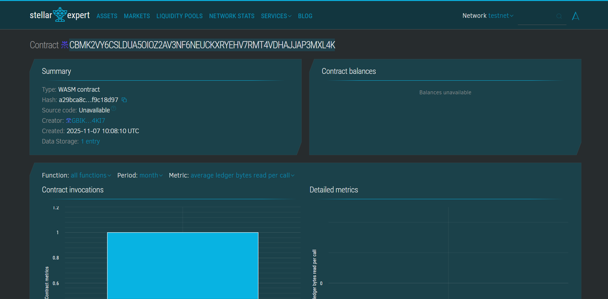

# Testnet Faucet Smart Contract

## Project Title
**Testnet Faucet for Stellar/Soroban Network**

Create a faucet that distributes testnet XLM to developers for testing their applications on the Stellar blockchain using Soroban smart contracts.

---

## Project Vision

The Testnet Faucet aims to streamline the development process for blockchain developers working on the Stellar network by providing an automated, fair, and efficient distribution system for testnet XLM tokens. Our vision is to:

- **Empower Developers**: Remove barriers to entry by providing free testnet tokens instantly
- **Foster Innovation**: Enable developers to test and experiment without financial constraints
- **Build Community**: Create a reliable infrastructure that supports the growing Stellar ecosystem
- **Ensure Fairness**: Implement cooldown mechanisms to prevent abuse while maintaining accessibility
- **Promote Adoption**: Accelerate Stellar/Soroban application development through accessible testing resources

This project represents our commitment to making blockchain development more accessible, efficient, and developer-friendly, ultimately contributing to the growth and success of the Stellar ecosystem.

---

## Key Features

### 1. **Automated Token Distribution**
- Instant distribution of testnet XLM tokens to requesting users
- Configurable drip amount per request
- Seamless integration with Stellar addresses

### 2. **Anti-Abuse Mechanism**
- Cooldown period between requests (configurable, default 24 hours)
- Prevents spam and ensures fair distribution
- Tracks user request history and timestamps

### 3. **Comprehensive Statistics Tracking**
- Total number of token requests processed
- Total amount of XLM distributed
- Number of active users utilizing the faucet
- Individual user request history and totals

### 4. **User Request Monitoring**
- Track each user's last request time
- Monitor total tokens received per user
- Count total requests made by each user
- Transparent request history

### 5. **Admin Configuration**
- Configurable drip amount
- Adjustable cooldown period
- One-time initialization to prevent tampering
- Secure admin controls

### 6. **Smart Storage Management**
- Efficient data structures for statistics and user data
- Extended TTL (Time To Live) for persistent storage
- Optimized gas usage through smart caching

---

## Future Scope

### Short-term Enhancements (3-6 months)
1. **Multi-tier Drip System**
   - Different token amounts based on user verification level
   - Developer program integration for higher limits
   - Github/Twitter verification for increased allowances

2. **Advanced Anti-Sybil Mechanisms**
   - Integration with decentralized identity solutions
   - Captcha or proof-of-work requirements
   - IP-based rate limiting (off-chain component)

3. **Admin Dashboard**
   - Web interface for monitoring faucet activity
   - Real-time statistics visualization
   - Manual token distribution capability for special cases

### Mid-term Goals (6-12 months)
1. **Cross-chain Faucet Support**
   - Support for multiple Stellar-based tokens
   - Integration with other testnet networks
   - Unified faucet interface for different test assets

2. **Gamification Features**
   - Daily login rewards
   - Referral bonuses for bringing new developers
   - Achievement system for consistent users

3. **Developer Engagement Tools**
   - Tutorial integration - receive tokens for completing tutorials
   - Project showcase - link faucet usage to project development
   - Community challenges and hackathon support

### Long-term Vision (1-2 years)
1. **DAO Governance**
   - Community voting on drip amounts and cooldown periods
   - Decentralized admin controls
   - Treasury management by token holders

2. **Analytics Platform**
   - Usage patterns and trends analysis
   - Developer ecosystem insights
   - Network health monitoring tools

3. **Enterprise Integration**
   - API for automated testing pipelines
   - CI/CD integration for development teams
   - Dedicated faucets for enterprise projects

4. **Sustainability Model**
   - Sponsorship program for token funding
   - Integration with Stellar Development Foundation
   - Community donation mechanism to replenish faucet

5. **Advanced Features**
   - Smart contract testing sandbox integration
   - Automated token return mechanism after testing
   - Multi-signature support for enterprise users
   - Transaction simulation and gas estimation tools

---

## Technical Architecture

### Smart Contract Functions

1. **`initialize(admin, drip_amount, cooldown_seconds)`**
   - Initializes the faucet with configuration parameters
   - Sets up admin controls and default values
   - One-time execution to ensure security

2. **`request_tokens(user)`**
   - Main function for users to request testnet XLM
   - Enforces cooldown period
   - Updates statistics and user records
   - Returns amount of tokens distributed

3. **`get_faucet_stats()`**
   - Returns overall faucet statistics
   - Provides transparency into faucet usage
   - Useful for monitoring and analytics

4. **`get_user_request(user)`**
   - Retrieves individual user's request history
   - Shows last request time and total received
   - Enables users to track their faucet usage

### Data Structures

- **FaucetStats**: Tracks global faucet metrics
- **UserRequest**: Stores individual user interaction data
- **Storage Keys**: Efficient mapping for quick data retrieval

---

## Installation & Deployment

### Prerequisites
```bash
# Install Rust
curl --proto '=https' --tlsv1.2 -sSf https://sh.rustup.rs | sh

# Install Soroban CLI
cargo install --locked soroban-cli

# Add wasm32 target
rustup target add wasm32-unknown-unknown
```

### Build the Contract
```bash
# Build optimized contract
soroban contract build

# Optimize wasm file
soroban contract optimize --wasm target/wasm32-unknown-unknown/release/testnet_faucet.wasm
```

### Deploy to Testnet
```bash
# Deploy contract
soroban contract deploy \
  --wasm target/wasm32-unknown-unknown/release/testnet_faucet.wasm \
  --source <YOUR_SECRET_KEY> \
  --network testnet

# Initialize faucet
soroban contract invoke \
  --id <CONTRACT_ID> \
  --source <ADMIN_SECRET_KEY> \
  --network testnet \
  -- initialize \
  --admin <ADMIN_ADDRESS> \
  --drip_amount 1000000000 \
  --cooldown_seconds 86400
```

### Request Tokens
```bash
soroban contract invoke \
  --id <CONTRACT_ID> \
  --source <USER_SECRET_KEY> \
  --network testnet \
  -- request_tokens \
  --user <USER_ADDRESS>
```

---

## Usage Example

```rust
// Initialize the faucet (one-time, admin only)
let admin = Address::from_string("GADMIN...");
let drip_amount: i128 = 100_0000000; // 100 XLM
let cooldown: u64 = 86400; // 24 hours

client.initialize(&admin, &drip_amount, &cooldown);

// User requests tokens
let user = Address::from_string("GUSER...");
let tokens_received = client.request_tokens(&user);

// Check faucet statistics
let stats = client.get_faucet_stats();
println!("Total distributed: {}", stats.total_distributed);

// Check user history
let user_data = client.get_user_request(&user);
println!("Last request: {}", user_data.last_request_time);
```

---

## Security Considerations

1. **Admin Initialization**: Contract can only be initialized once to prevent reconfiguration attacks
2. **Cooldown Enforcement**: Prevents spam and ensures fair distribution
3. **Address Authentication**: Requires user signature for token requests
4. **Storage TTL Management**: Ensures data persistence and contract longevity

---

## Contributing

We welcome contributions from the community! Please feel free to:
- Report bugs and issues
- Suggest new features
- Submit pull requests
- Improve documentation

---

## License

This project is licensed under the MIT License - see the LICENSE file for details.

---

## Contact & Support

- **GitHub**: [Your Repository URL]
- **Discord**: [Community Server]
- **Email**: support@testnetfaucet.example


## Contract Details
Contract ID:
CBMK2VY6CSLDUA5OIOZ2AV3NF6NEUCKXRYEHV7RMT4VDHAJJAP3MXL4K



